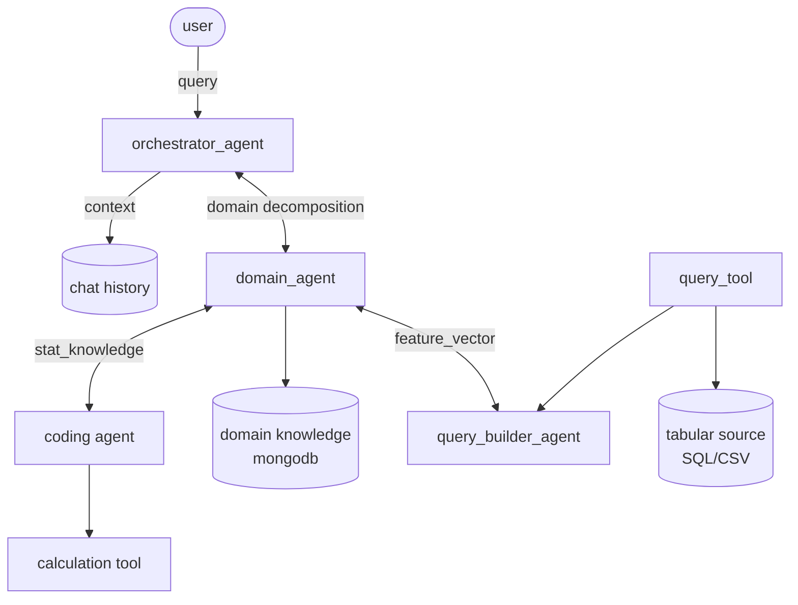

# MVP Agentic Data Analysis Checklist

This checklist defines the MVP milestones for a LangGraph-based, JSON-first,
Python-tool-based data analysis workflow.

The MVP focuses on:

- Tool schemas and deterministic helper tools.
- LangGraph agent orchestration.
- Redis memory key/API contracts.
- A query agent that reads structured EDA memory and updates global state.
- A feature agent that calls statistical tools and updates global state.
- A domain agent that adds actionable requirements and ambiguity handling.

## Tech Stack

- **Agent orchestration:** LangGraph coordinates agents, graph state,
  conditional routing, tool execution nodes, and state transitions.
- **Memory backend:** Redis services store memory categories. Operational
  Redis stores conversation/session/dataset state, and Redis Stack stores
  vector-backed EDA/domain memory.
- **Tool runtime:** Python-based tools run approved CSV/tabular and statistical
  operations through the unified tool interface.

## Global State Note

The global state schema is provisional. It should remain easy to change while
the team validates agent responsibilities, tool outputs, memory boundaries, and
handoff contracts.

For the MVP, every agent or tool that writes to global state must document:

- Which state keys it reads.
- Which state keys it writes.
- Whether the write replaces, appends, or merges data.
- What provenance is attached to the update.
- What downstream node consumes the update.

## Agentic Workflow Design

The MVP target architecture from the design sketch is:



Design contracts implied by the sketch:

- `orchestrator_agent` receives the user query, retrieves chat context, and
  delegates domain decomposition to `domain_agent`.
- `domain_agent` owns domain decomposition, consults domain knowledge, requests
  statistical knowledge from `coding agent`, and exchanges feature vectors with
  `query_builder_agent`.
- `coding agent` is limited to calculation/statistical support through
  deterministic tools.
- `query_builder_agent` builds executable data queries from feature vectors and
  uses `query_tool` to access the tabular source.
- `chat history`, `domain knowledge`, and `tabular source` are separate memory
  or data stores with explicit read/write contracts.

## MVP Scope

### In Scope

- JSON-first contracts for tool requests, tool results, agent requirements,
  and state updates.
- Deterministic Python helper tools for CSV/tabular handling and statistical
  computation.
- LangGraph used as the agent orchestration framework.
- Redis key/API contracts configured by purpose rather than one generic memory
  bucket.
- Query, feature, and domain agents with explicit tool usage.
- Global state updates after each agent/tool stage.
- Validation for single-variable and multivariate scenarios.

### Out Of Scope

- Arbitrary unrestricted Python execution.
- Finalized production global state schema.
- UI changes unless required for existing endpoint verification.
- Hardcoded dataset-specific behavior.
- Broad modeling stack beyond what the MVP tools require.
- Model-native LLM tool calling as a required dependency.

## Milestone 1: Tool Schemas And Deterministic Helper Tools

Goal: define the tool schemas first, then implement deterministic helper tools
for statistics and CSV/tabular data handling. MVP tools should be callable by
name with validated JSON inputs and should not require model-native tool
calling.

### Required Tools

- [x] CSV/dataframe loader tool.
- [x] Dataset profile tool.
- [x] Column metadata tool.
- [x] Missingness summary tool.
- [x] Type compatibility tool.
- [x] Correlation/statistical association tool.
- [x] Basic statistical summary tool.
- [x] Deterministic custom metric helper for approved simple calculations.

### Tool Interface Tasks

- [x] Define `ToolRequest` JSON schema.
- [x] Define `ToolResult` JSON schema.
- [x] Require `tool_name`, `request_id`, `caller`, `purpose`, `inputs`, and
  `expected_output_schema` in every request.
- [x] Require `status`, `data`, `summary`, `warnings`, `error`, and
  `provenance` in every result.
- [x] Normalize error types: invalid column, incompatible type, insufficient
  rows, missing values, timeout, invalid code, invalid result shape, and
  unsupported method.
- [x] Prefer deterministic helper functions over generated Python execution
  for the first MVP pass.
  
### Current Status

Checked against the current repository on 2026-06-24:

- Implemented: `ToolRequest`, `ToolResult`, normalized tool errors,
  `CSVDataLoaderTool`, and `DatasetProfileTool`.
- Implemented in `DatasetProfileTool`: dataset profile, column metadata,
  missingness summary, and type compatibility.
- Implemented in `StatisticalAnalysisTool`: correlation/statistical
  association, basic statistical summary, and approved deterministic custom
  metrics.
- Graph wiring implemented: the QA LangGraph now runs `column_metadata`,
  `missingness_summary`, `type_compatibility`, `basic_statistical_summary`,
  `statistical_association`, and `custom_metric` tool nodes after active EDA
  context loading when `cleaned_file_path` is available.
- Graph state now captures `tool_requests`, `tool_results`,
  `statistical_findings`, and `warnings` from those deterministic tool nodes.
- Milestone 1 helper tools are implemented without unrestricted generated
  Python execution.
- Not implemented: constrained Python extension point.
- Test source for Milestone 1 is not present in `tests/`; only a compiled
  `tests/__pycache__/test_tools_phase1...pyc` artifact exists.

### Suggested Request Shape

```json
{
  "tool_name": "stats.correlation",
  "request_id": "string",
  "caller": "feature_agent",
  "purpose": "Measure relationship between two numeric columns.",
  "inputs": {
    "dataset_id": "active",
    "columns": ["sales", "profit"],
    "method": "pearson"
  },
  "expected_output_schema": "ToolResult"
}
```

### Suggested Result Shape

```json
{
  "tool_name": "stats.correlation",
  "request_id": "string",
  "status": "ok",
  "data": {
    "method": "pearson",
    "correlation": 0.72,
    "p_value": 0.001
  },
  "summary": "sales and profit have a positive relationship.",
  "warnings": [],
  "error": null,
  "provenance": {
    "dataset_id": "active",
    "columns": ["sales", "profit"],
    "rows_used": 1000,
    "missing_rows_dropped": 0
  }
}
```

### Exit Criteria

- [x] Every MVP tool can be called through the same request/result envelope.
- [x] Tool failures are machine-readable.
- [x] Tool results can be written into global state without parsing free-form
  text.
- [x] No MVP path depends on unrestricted generated Python code.

## Milestone 2: Redis Memory Key/API Contracts

Goal: define Redis key patterns and API contracts before expanding agent logic.
Each memory kind should have a purpose, owner, lifecycle, and predictable
serialization format while LangGraph orchestrates read/write timing.

### Memory Types

- [x] Conversation memory: user questions and final assistant answers.
- [x] Dataset memory: active dataset id, cleaned file path, shape, profile, and metadata.
- [x] Domain memory: Text corpus that contains domain knowledge as embedding / vector
- [x] Tool memory: tool requests, tool results, warnings, and provenance.
- [x] Agent working memory: active requirements, assumptions, intermediate findings, and unresolved questions.
- [x] Curated context memory: validated reusable facts and decisions.
- [x] Error memory: recoverable failures, blocked tasks, and retry context.

### LangGraph And Redis Tasks

- [x] Define Redis key pattern for each memory type.
- [x] Define read API for each memory type.
- [x] Define write API for each memory type.
- [x] Decide which memory fields belong in LangGraph state for one run.
- [x] Define read/write policy for each memory type.
- [x] Define merge behavior for concurrent or repeated writes.
- [x] Add provenance requirements for memory writes.
- [x] Define compaction rules for large tool outputs or long context.
- [x] Add `schema_version` or equivalent metadata to memory payloads.

### Current Status

Checked against the current repository on 2026-06-25:

- Implemented conversation memory through LangGraph checkpointing. The QA graph
  uses `RedisSaver` when Redis supports the required Redis Stack/RediSearch
  commands and falls back to an in-process checkpointer when Redis reports
  unknown `FT.*` commands.
- `/ask` accepts optional `thread_id`; when omitted, it uses the active EDA
  `job_id` created by `/eda/analyze` so each analyzed dataset gets its own
  conversation thread.
- `/ask` now returns the final `GraphState`. The parsed `response` field is a
  JSON-safe dict instead of a `QAResponse` object, avoiding checkpoint
  deserialization warnings for unregistered Python classes.
- Dataset memory exists in Redis through `EDAStore`: active EDA job,
  job status, EDA result payload, cleaned file path, and shape/profile
  metadata use purpose-specific `eda:*` keys with `SESSION_TTL`.
- Domain vector memory is implemented through LangChain `RedisVectorStore`
  against a dedicated Redis Stack service via `REDIS_VECTOR_URL` /
  `REDIS_VECTOR_INDEX`. EDA generated summary chunks use
  `memory_type="eda_summary"`, generated domain insight chunks use
  `memory_type="domain_generated"`, and custom domain augmentations use
  `memory_type="domain_custom"`.
- Vector memory records use `vector:{memory_type}:{job_id}:{chunk_id}` keys
  with `schema_version`, provenance/source fields, text, metadata JSON, and
  FLOAT32 embeddings. `/domain-memory/{job_id}` appends custom domain
  knowledge, and `/domain-memory/{job_id}/search` retrieves generated/custom
  domain context by vector search.
- QA graph now retrieves domain memory before deterministic tool nodes and
  stores retrieved snippets in `domain_context` plus merged metric/feature
  hints in `domain_requirements`.
- Agent meta-memory is implemented in operational Redis through
  `app/memory/context_store.py`. The store exposes one class per memory type:
  `ToolMemory`, `AgentWorkingMemory`, `CuratedContextMemory`, and
  `ErrorMemory`, coordinated by `ContextStore`.
- Meta-memory keys are `meta:{scope_id}:tool_memory`,
  `meta:{scope_id}:agent_working_memory`, `meta:{scope_id}:curated_context`,
  and `meta:{scope_id}:error_memory`, scoped by active EDA `job_id` /
  `dataset_id` with `session_id` fallback.
- QA graph now loads meta-memory before deterministic tool nodes and saves it
  after parse. `GraphState` includes `run_id`, `tool_memory`,
  `agent_working_memory`, `curated_context`, and `error_memory`.
- List memories append and trim to the latest 100 records; working memory
  replaces the latest snapshot. Stored records include `schema_version`,
  `scope_id`, `thread_id`, `run_id`, `created_at`, `source_node`, and
  provenance. Curated context uses `validation_status="system_generated"` for
  successful final QA answers.
- Not implemented yet: human-validated curated context, advanced memory
  compaction beyond compact records/list trimming, and cross-process conflict
  resolution beyond Redis atomic append/replace operations.

### Provisional State Fields

These fields are a starting point, not a final schema:

```python
class AnalysisState(TypedDict):
    question: str
    dataset_id: str
    dataset_profile: dict
    domain_requirements: dict
    query_plan: dict
    feature_plan: dict
    tool_requests: list[dict]
    tool_results: list[dict]
    findings: list[dict]
    warnings: list[str]
    global_state_updates: list[dict]
    response: dict
```

### Exit Criteria

- [x] Each memory type has a clear purpose.
- [x] Agents know where to read context from.
- [x] Agents know where to write outputs.
- [x] Temporary working context is separated from curated reusable context.
- [x] Redis memory payloads include schema/version metadata.

## Milestone 3: Multi-Agent System Foundation

Goal: establish the LangGraph multi-agent foundation so an orchestrator can
parse the user request, load structured EDA/domain context, route work to
specialist agents, and merge machine-readable state updates for downstream
milestones.

### Responsibilities

- [ ] Define the MVP agent roles: `orchestrator_agent`, `domain_agent`,
  `query_builder_agent`, and `coding_agent`.
- [ ] Define each agent handoff contract: input state keys, output state keys,
  merge behavior, provenance, warnings, and downstream consumer.
- [ ] Add an orchestrator route that parses the user question into analysis
  intent, risk level, and required specialist agents.
- [ ] Load structured EDA memory: `num_stats`, `cat_stats`, shape, profile text,
  cleaned file path, and summary metadata before agent routing.
- [ ] Load relevant domain/vector memory as supplemental context with source
  provenance and uncertainty markers.
- [ ] Have `query_builder_agent` identify candidate columns and retrieval
  evidence from structured dataset memory without Markdown-only parsing.
- [ ] Have `coding_agent` select deterministic helper tools for lightweight
  validation or statistical support requested by another agent.
- [ ] Emit `ToolRequest` JSON for every tool call.
- [ ] Consume `ToolResult` JSON and attach results to the producing agent's
  state namespace.
- [ ] Merge agent outputs into global state with intent, selected agents,
  candidate columns, retrieval evidence, confidence, warnings, and open
  questions.

### Current Status

Checked against `DEVELOPMENT.md` on 2026-06-26:

- Partially implemented through the current QA LangGraph foundation. The graph
  already loads conversation history, active EDA context, domain vector memory,
  and operational Redis meta-memory before deterministic tool nodes.
- `GraphState` already carries `session_id`, `run_id`, `history`, `context`,
  `domain_context`, `domain_requirements`, `eda_result`, `dataset_id`,
  `dataset_file_path`, `tool_requests`, `tool_results`,
  `statistical_findings`, `warnings`, and parsed `response`.
- Dedicated `orchestrator_agent`, `query_builder_agent`, `coding_agent`, and
  `domain_agent` nodes are not implemented yet. Current routing is still the
  linear QA graph described in `DEVELOPMENT.md`.
- The current graph can retrieve structured EDA/domain context and append
  deterministic tool outputs to global state, but it does not yet emit
  explicit agent handoff records, selected specialist agents, query plans,
  candidate columns, confidence scores, or open questions as separate
  multi-agent state namespaces.

### Tools Used

- [ ] Dataset profile tool.
- [ ] Column metadata tool.
- [ ] Type compatibility tool.
- [ ] CSV/dataframe preview or filtered retrieval tool.
- [ ] Correlation/statistical association tool when requested through
  `coding_agent`.
- [ ] Basic statistical summary tool when requested through `coding_agent`.
- [ ] Optional text retrieval tool for stored Markdown/profile context as a
  supplement, not the source of truth.

### Global State Updates

- [ ] `analysis_intent`
- [ ] `selected_agents`
- [ ] `agent_handoffs`
- [ ] `query_plan`
- [ ] `candidate_columns`
- [ ] `retrieved_context`
- [ ] `domain_context`
- [ ] `coding_plan`
- [ ] `tool_requests`
- [ ] `tool_results`
- [ ] `warnings`
- [ ] `open_questions`

### Exit Criteria

- [ ] Orchestrator can route a request to the required specialist agents.
- [ ] Agent handoffs are JSON-first and documented by state read/write keys.
- [ ] Query builder can map user wording to likely dataset columns.
- [ ] Agents retrieve structured EDA context for downstream stages.
- [ ] Agents do not fabricate unavailable columns, metrics, or domain facts.
- [ ] Agent outputs merge into global state as machine-readable updates.

## Milestone 4: Feature Agent Calls Statistical Tools

Goal: complete the feature agent so it evaluates candidate features by calling
deterministic statistical tools, records assumptions and warnings, and updates
global state.

### Responsibilities

- [ ] Consume query agent output and domain agent requirements.
- [ ] Validate feature compatibility for requested analysis.
- [ ] Determine required statistical computations.
- [ ] Select appropriate Python-based tools.
- [ ] Generate `ToolRequest` JSON for statistical computation.
- [ ] Consume `ToolResult` JSON.
- [ ] Produce feature findings with metric values, assumptions, warnings, and
  provenance.
- [ ] Update global state with feature roles, statistical findings, and
  unresolved issues.

### Current Status

Checked against `DEVELOPMENT.md` on 2026-06-26:

- Deterministic statistical support is implemented and wired into the current
  QA graph through `basic_statistical_summary`, `statistical_association`, and
  `custom_metric` nodes.
- Tool calls already use `ToolRequest` / `ToolResult` and update
  `tool_requests`, `tool_results`, `statistical_findings`, and `warnings`.
- A dedicated `feature_agent` that consumes query/domain handoffs, records
  feature roles, plans computations, and writes `feature_plan` /
  `feature_roles` is not implemented yet.

### Tools Used

- [ ] Missingness summary tool.
- [ ] Type compatibility tool.
- [ ] Correlation/statistical association tool.
- [ ] Basic statistical summary tool.
- [ ] Deterministic custom metric helper for approved simple calculations.

### Global State Updates

- [ ] `feature_plan`
- [ ] `feature_roles`
- [ ] `statistical_findings`
- [ ] `tool_requests`
- [ ] `tool_results`
- [ ] `warnings`
- [ ] `open_questions`

### Exit Criteria

- [ ] Feature agent can compute or request required statistics for candidate
  features.
- [ ] Feature agent records assumptions and warnings.
- [ ] Feature agent returns structured findings that downstream synthesis can
  consume.
- [ ] Feature agent updates global state without relying on Markdown parsing.

## Milestone 5: Domain Agent Requirements And Ambiguity Handling

Goal: complete the domain agent so it adds actionable requirements and
ambiguity handling for the query and feature agents.

The domain agent should be domain-augmenting, not domain-hardcoded. It may infer
business meaning, constraints, and analysis intent from the question, dataset
profile, memory, and retrieved context, but it must preserve uncertainty when
the domain is unclear.

### Responsibilities

- [ ] Interpret the user question into an analysis objective.
- [ ] Identify domain terms and map them to candidate dataset concepts.
- [ ] Define actionable requirements for the query agent.
- [ ] Define actionable requirements for the feature agent.
- [ ] Identify required metrics, comparisons, filters, groups, and time windows.
- [ ] Identify ambiguity, missing context, or risky assumptions.
- [ ] Decide when the answer should ask for clarification instead of forcing an
  analysis path.
- [ ] Select tools needed to inspect dataset context or prior memory.
- [ ] Update global state with requirements, assumptions, constraints, and
  unresolved questions.

### Current Status

Checked against `DEVELOPMENT.md` on 2026-06-26:

- Domain vector memory is implemented through Redis Stack and
  `RedisVectorStore`; the QA graph loads generated/custom domain context into
  `domain_context` and merged metric/feature hints into `domain_requirements`.
- Existing tool-selection helpers can prefer exact metric and feature hints
  from domain memory when available.
- A dedicated `domain_agent` that turns user intent into actionable
  requirements, preserves ambiguity, decides when clarification is needed, and
  writes assumptions/open questions is not implemented yet.

### Tools Used

- [ ] Dataset profile tool.
- [ ] Column metadata tool.
- [ ] Context/memory retrieval tool.
- [ ] Type compatibility tool when requirements imply specific variables.

### Global State Updates

- [ ] `domain_requirements`
- [ ] `analysis_objective`
- [ ] `required_metrics`
- [ ] `required_filters`
- [ ] `candidate_concepts`
- [ ] `assumptions`
- [ ] `warnings`
- [ ] `open_questions`

### Exit Criteria

- [ ] Domain agent produces requirements that query and feature agents can
  consume directly.
- [ ] Domain agent preserves ambiguity instead of forcing unsupported
  assumptions.
- [ ] Domain agent writes structured global state updates.
- [ ] Domain agent does not hardcode behavior for a single dataset.

## MVP Acceptance Checklist

- [x] Essential statistics and CSV/tabular tools are defined.
- [x] All MVP tools use one request/result interface.
- [x] LangGraph is used as the agent orchestration framework.
- [x] Redis key/API contracts are separated by purpose.
- [x] All memory kinds are backed by Redis with schema/version metadata.
- [ ] Query agent reads structured EDA memory and updates global state.
- [ ] Feature agent calls statistical tools and updates
  global state.
- [ ] Domain agent converts user intent into actionable requirements and
  handles ambiguity before updating global state.
- [x] Global state schema is treated as provisional during MVP development.
- [x] Tool outputs and agent outputs are JSON-first.
- [x] Errors and warnings are machine-readable.
- [ ] No downstream stage depends on parsing Markdown tables.
- [x] No Python execution is unrestricted.

## Recommended MVP Build Order

```text
1. Tool schemas and deterministic helper tools
2. Redis memory key/API contracts
3. Multi-agent system foundation
4. Feature agent calls statistical tools
5. Domain agent adds requirements and ambiguity handling
6. End-to-end global state update validation
```
